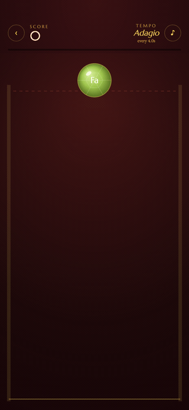
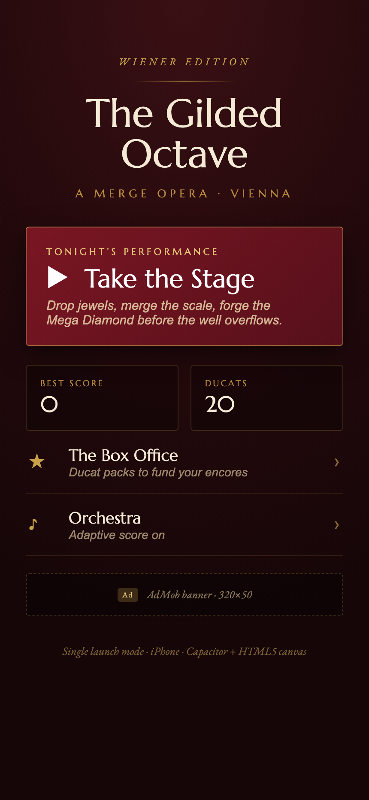
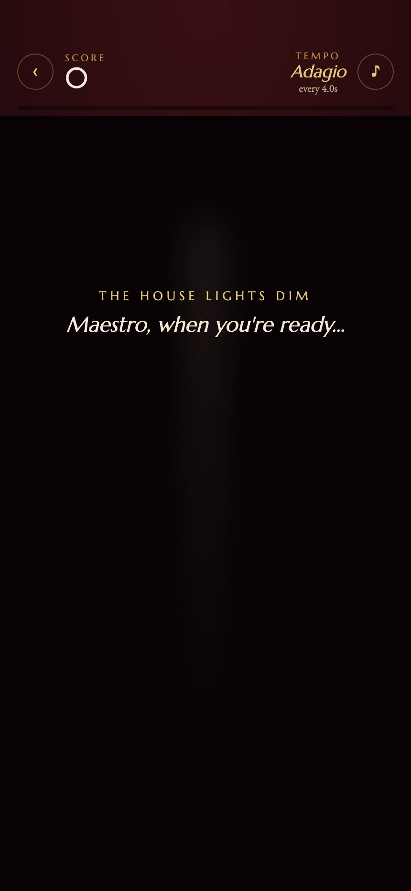
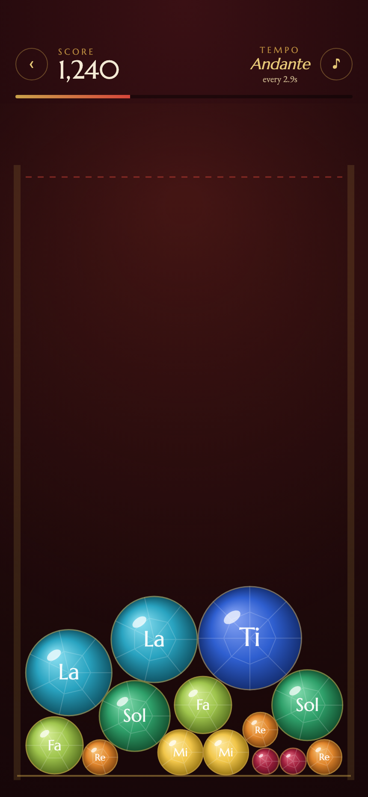
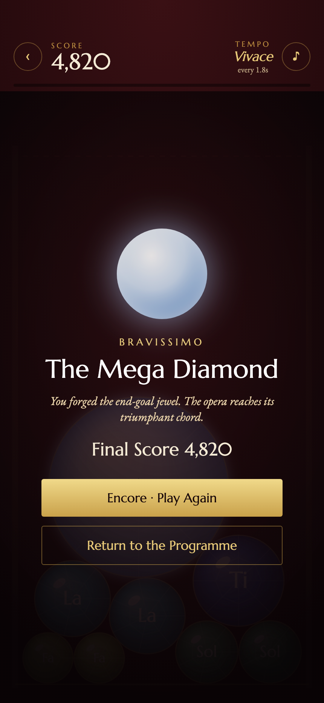
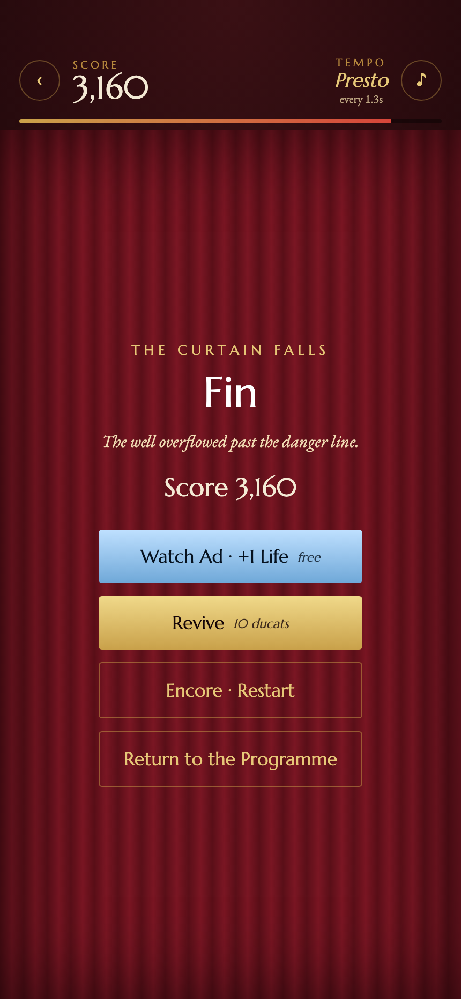
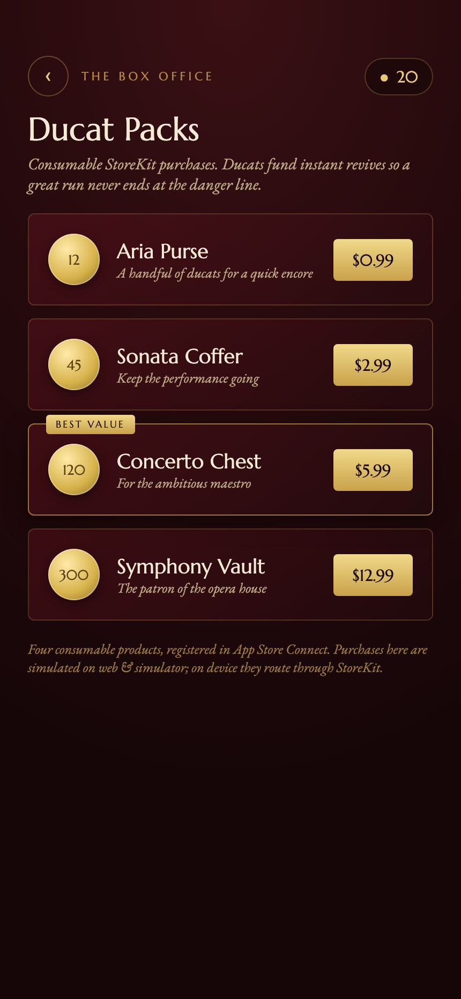
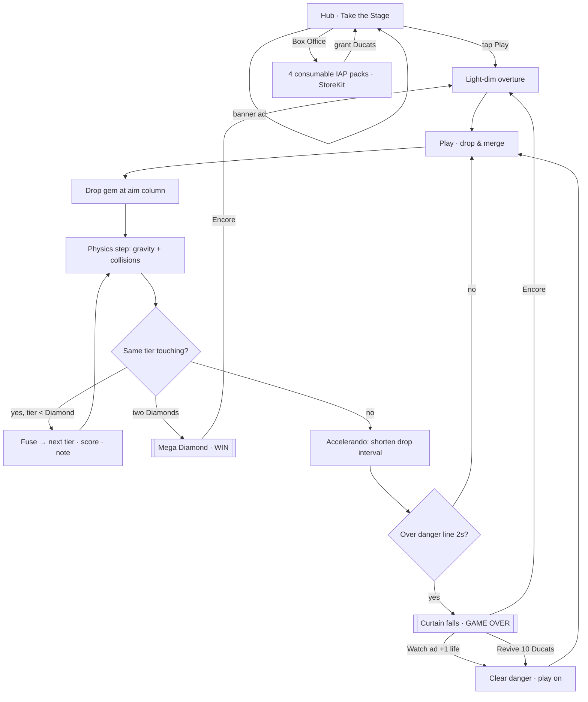

# The Gilded Octave

A Vienna opera-house **merge game**, built as a **Capacitor iOS** app with
**HTML5 canvas** gameplay. Drop faceted jewels, merge the musical scale, and
forge the durable **Mega Diamond** before the well overflows past the danger line.

<p align="center">
  
</p>

## Screenshots

| Hub | Light-dim intro | Play |
|-----|-----------------|------|
|  |  |  |

| Win · Mega Diamond | Game over · revive | Box Office · IAP |
|--------------------|--------------------|------------------|
|  |  |  |

## What it shows

A complete, launch-ready merge game built to a single polished mode.

- **Merge + physics gameplay** on an HTML5 canvas - gravity, wall/floor
  collisions, and same-tier fusion, all in a dependency-free TypeScript engine.
- **Top-tier win condition** - a ten-jewel tier ladder (Garnet → Diamond), each
  jewel a note of the scale. Two Diamonds fuse into the **Mega Diamond**: a
  durable end-goal that frees no board space, so winning is a deliberate climb,
  never an accident. The game stays winnable yet losable.
- **Accelerando difficulty** - timed gem drops after a calm 15s opening, then
  the interval shortens 15% every 12s down to a 1.1s floor (Adagio → Presto).
- **Genuine fail state** - a jewel resting above the danger line for 2 seconds
  brings the curtain down. A live danger meter telegraphs the threat.
- **Adaptive orchestral score** (Web Audio) - a string pad that swells with the
  on-board intensity, a per-merge note sample for every fusion, a resolved major
  chord on the win, and a falling sting on the loss.
- **Theatrical light-dim overture** - a clearly visible iris + spotlight dim
  before every performance.
- **Rewarded "+1 life" revive** - watch a rewarded video on game-over to clear
  the danger meter and play on, or revive with Ducats.
- **4 consumable IAP packs (StoreKit)** - a Box Office storefront granting the
  Ducat soft currency.
- **Rewarded + banner ads (AdMob)** and an **App Store Connect + TestFlight**
  pipeline (see `store/`).

> The app is demoable on a simulator with no hardware: ads and StoreKit are
> simulated behind a tap, and merges/audio need no native plugin.

## Feature flow



## Architecture

Capacitor 6 + Vite + TypeScript. The game core is plain TypeScript with no
framework - the simulation is pure and DOM-free, which keeps it testable and
fast inside the iOS WKWebView.

```
src/
  main.ts              app shell + screen router (hub / play / shop)
  game/
    gems.ts            the ten-tier ladder + Mega Diamond data
    engine.ts          merge + physics simulation (pure, no DOM)
    renderer.ts        canvas drawing: stage, faceted gems, danger line
    audio.ts           adaptive Web Audio score + per-merge notes
  services/
    iap.ts             StoreKit consumables (4 packs)
    ads.ts             AdMob rewarded "+1 life" + banner
    haptics.ts         Capacitor Haptics wrapper
    storage.ts         best score + Ducat wallet (localStorage)
  ui/
    hub.ts play.ts shop.ts   screens
store/                 App Store Connect listing, IAP, AdMob, content rating, TestFlight
design/                source-of-truth design export + notes
ios/                   generated Capacitor iOS project (Xcode workspace)
```

Engine at a glance:

```ts
const engine = new MergeEngine(onEvent);   // onEvent: merge | win | lose
engine.layout(width, height);
engine.start();
engine.drop();                              // drop the queued gem at engine.aimX
engine.step(dt);                            // advance physics + merges + fail check
```

## Run

```bash
npm install
npm run dev          # play in the browser at iPhone size

# iOS (Capacitor)
npm run build
npx cap sync ios
npx cap open ios     # archive / run from Xcode
```

## Stack

TypeScript · Vite · Capacitor 6 · HTML5 Canvas 2D · Web Audio API ·
StoreKit (IAP) · AdMob · Capacitor Haptics
